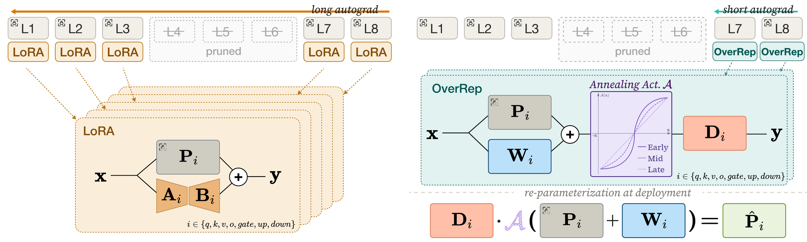

# Train Overcomplete, Deploy Compact: Scaling Recovery Capacity for Structured LLM Pruning

**Scale recovery capacity during training, then merge it away.** OverRep prunes LLMs more effectively at the same deployment cost.


<div align="left">
  <a href="https://2026.emnlp.org/"><picture><source media="(prefers-color-scheme: dark)" srcset="https://raw.githubusercontent.com/SoongE/SoongE/badge/emnlp-2026-dark.svg"></picture></a>
  <a href="https://arxiv.org/abs/2609.06974"><picture><source media="(prefers-color-scheme: dark)" srcset="https://raw.githubusercontent.com/SoongE/SoongE/badge/arxiv-2609.06974-dark.svg"></picture></a>
  <a href="https://huggingface.co/SoongE/OverRep"><picture><source media="(prefers-color-scheme: dark)" srcset="https://raw.githubusercontent.com/SoongE/SoongE/badge/checkpoints-dark.svg"></picture></a>
  <a href="LICENSE"><picture><source media="(prefers-color-scheme: dark)" srcset="https://raw.githubusercontent.com/SoongE/SoongE/badge/license-apache-2.0-dark.svg"></picture></a>
</div>


<p align="center">
  
</p>

## Overview

**Overcomplete Recovery Module (ORM).** Structured pruning removes whole transformer blocks, but
conventional recovery (LoRA-style) gives the recovery module far less capacity than the knowledge it
must restore — the *capacity-knowledge asymmetry*. OverRep temporarily expands every linear
projection of the two recovery blocks as `P̂ᵢ = Dᵢ(Pᵢ + Wᵢ)`: an additive branch `Wᵢ` (init 0) widens
the optimization space and a multiplicative factor `Dᵢ` (init I) reshapes its geometry, so training
starts exactly at the pretrained operating point.

**Annealed activation.** A scheduled activation `𝒜ₛ(x) = αₛ·σ(x) + (1-αₛ)·x` gives the ORM nonlinear
dynamics early in training and returns to the identity map (warm-up → cosine → linear-stabilization),
so at the end of training every triplet merges *exactly* into a single standard weight
`P̂ᵢ = Dᵢ(Pᵢ + Wᵢ)`. The deployed checkpoint is a plain Hugging Face model — same architecture,
parameters, memory, and latency as any other pruned model.

**Pruning mask notation `T:I`** — block `T` is the first recovery block, layers `T+1 … T+I` are
pruned, and block `T+I+1` is the second recovery block. Layer-wise distillation maps the hidden
state entering layer `T` (i.e. the output of layer `T-1`) to the output of layer `T+I+1`.

## Setup

```bash
uv sync
```

The lockfile pins `torch==2.11.0+cu128` and `transformers==4.57.1` on Python 3.12; resolution is
restricted to Linux/x86_64 with an NVIDIA GPU (driver 570+). Installation is editable, so every
command below lands in `.venv/bin/`.

Weights & Biases logging is off by default; pass `--wandb` to `overrep-train` and set
`WANDB_ENTITY` if runs should land in a team entity.

### Repository layout

```
src/overrep/
  features/       prepare_data.py, dump_hidden_for_{mse,kd}.py, build_manifest.py
  models/
    reparam_module*.py    ORM projections per backbone family (llama, qwen, qwen3_moe)
    reparam_model.py      recovery-block LMs, REPARAM_PRESETS (OverRep + Table 4 ablations)
    deploy_model.py       algebraic merge into a standard pruned HF checkpoint
    vanishing_activation.py   the annealed activation 𝒜ₛ
  train/          mse.py (OverRep, layer-wise MSE), kd.py (OverRep-KD, cached logit distillation)
  eval/           harness.py (lm_eval wrapper), score.py (paper-convention tables), tasks/
  runners/        runner.py + config.py (train→eval grid over a GPU pool)
```

### Backbones and pruning masks

| Backbone | HF repo | 25% mask | 50% mask |
| --- | --- | --- | --- |
| LLaMA2-7B  | `meta-llama/Llama-2-7b-hf`  | `22:8`  | `14:16` |
| LLaMA2-13B | `meta-llama/Llama-2-13b-hf` | `28:10` | `18:20` |
| LLaMA3-3B  | `meta-llama/Llama-3.2-3B`   | `17:9`  | `10:16` |
| LLaMA3-8B  | `meta-llama/Llama-3.1-8B`   | `21:9`  | `12:18` |
| Qwen3-4B   | `Qwen/Qwen3-4B-Base`        | `23:11` | `13:21` |
| Qwen3-8B   | `Qwen/Qwen3-8B-Base`        | `24:10` | `14:20` |
| Qwen3-14B  | `Qwen/Qwen3-14B-Base`       | `18:10` | `18:20` |
| Qwen3-30B-A3B (MoE) | `Qwen/Qwen3-30B-A3B-Base` | `34:12` | `22:24` |

For a mask `T:I`, the caching stage dumps layers `T-1` and `T+I+1`.

### Pretrained checkpoints

The Llama recovery checkpoints of the paper are on [Hugging Face](https://huggingface.co/SoongE/OverRep),
one folder per backbone and pruning ratio (`layer_T.safetensors` and `overrep_config.json` with the mask):

```bash
hf download SoongE/OverRep --include "llama-3.2-3b/25pct/*" --local-dir checkpoints
overrep-eval deploy_model hellaswag --custom --tokenizer-name meta-llama/Llama-3.2-3B \
  --include-layer 17:9 --checkpoint checkpoints/llama-3.2-3b/25pct
```

## Reproducing the pipeline

The walkthrough below recovers **LLaMA3-3B at 25% pruning (mask `17:9`)** end to end. Swap the model
name, mask, and dumped layers from the table above for any other setting.

**1. Tokenize the recovery dataset** (12,000 FineWeb-Edu documents, once per backbone tokenizer):

```bash
overrep-prepare --model meta-llama/Llama-3.2-3B --out data/tokenized/finewebedu_llama3
```

**2. Cache hidden states** (`T-1 = 16` as input, `T+I+1 = 27` as target, per split):

```bash
for split in train test; do
  overrep-cache --model meta-llama/Llama-3.2-3B \
    --dataset data/tokenized/finewebedu_llama3_$split \
    --layers 16 27 --out data/finewebedu_llama3-3b_manifest_$split
done
```

**3. Train the ORM** (`--va` turns on the annealed activation, `--rep_norm` the reparameterized norms):

```bash
CUDA_VISIBLE_DEVICES=0 overrep-train --custom \
  --config_name meta-llama/Llama-3.2-3B --model_name_or_path llama3_3B_OverRep \
  --dataset data/finewebedu_llama3-3b_manifest \
  --target_layer 17 --layer_interval 9 \
  --epochs 20 --batch_size 8 --gradient_accumulation_steps 1 \
  --mixed_precision bf16 --num_workers 4 \
  --learning_rate 1e-4 --weight_decay 1e-2 --min_learning_rate 1e-5 \
  --va --rep_norm --should_log --name llama3-3b-25pct
```

The registry name is `{backbone}_{preset}` (`llama2_7B_OverRep`, `qwen3_8B_OverRep`, …). The merged
checkpoint is written to `output/llama3-3b-25pct/layer_17.pth`.

**4. Merge and evaluate.** `deploy_model` folds the ORM into a standard pruned checkpoint and
evaluates it with `lm-eval`. The paper protocol is seven jobs per model:

```bash
for job in "0 hellaswag" "0 winogrande,arc_easy,mathqa,race" "0 mmlu" \
           "0 arc_challenge,openbookqa,piqa,boolq" "0 coqa" "8 gsm8k" "5 triviaqa"; do
  set -- $job
  CUDA_VISIBLE_DEVICES=0 overrep-eval deploy_model $2 --custom \
    --tokenizer-name meta-llama/Llama-3.2-3B --num-fewshot $1 \
    --name llama3-3b-25pct --include-layer 17:9 --checkpoint output/llama3-3b-25pct \
    --save-file results/results.csv
  # dense baseline for RP(%), on the same tasks and shots
  CUDA_VISIBLE_DEVICES=0 overrep-eval meta-llama/Llama-3.2-3B $2 --num-fewshot $1 \
    --name llama3-3b-dense --save-file results/results.csv
done
```

Generation tasks route through vLLM after merging. vLLM is not in the lockfile (it would change the
pinned environment); install it with `uv pip install vllm==0.20.2`, or pass `--hf-gen` to use the HF
backend everywhere, as `overrep-runner` does. Already-recorded (model, task, shot) rows are skipped
on re-runs, and the full raw lm-eval output is kept under `results/raw/`.

**5. Aggregate into the paper tables** (rea = 10-task average, gen = CoQA F1 / GSM8K EM /
TriviaQA EM, `RP = pruned ÷ dense × 100`):

```bash
overrep-score report --filename results/results.csv --dense llama3-3b-dense --save wide.csv
```

<details>
<summary><b>OverRep-KD</b></summary>

OverRep-KD replaces the layer-wise MSE with logit-level distillation against cached teacher
streams — mathematically identical to live KD, but without keeping the teacher resident:

```bash
overrep-cache-kd --model meta-llama/Llama-3.2-3B \
  --dataset data/tokenized/finewebedu_llama3_train \
  --targets 17 --out data/kdcache_llama3-3b

CUDA_VISIBLE_DEVICES=0 overrep-train-kd \
  --config_name meta-llama/Llama-3.2-3B --model_key llama3_3B_OverRep \
  --target_layer 17 --layer_interval 9 --cache_root data/kdcache_llama3-3b \
  --epochs 20 --batch_size 8 --name llama3-3b-25pct-kd
```

Checkpoints share the merged `layer_{T}.pth` format, so evaluation is unchanged.
</details>

<details>
<summary><b>Ablations</b></summary>

Each Table 4 configuration is a registry preset — substitute it for `OverRep` in
`--model_name_or_path`:

| preset | Table 4 row |
| --- | --- |
| `AbBase` | Plain |
| `AbAttnW`, `AbAttnD`, `AbMLPW`, `AbMLPD` | single-component |
| `AbW`, `AbD` | Wᵢ only / Dᵢ only |
| `AbWD` | Uniform |
| `AbHyb` | Hybrid |
| `OverRep` | Hybrid on the first recovery block, Wᵢ and Dᵢ on both attention and MLP of the second, trained with 𝒜ₛ (`--va`) |
</details>

<details>
<summary><b>Grid runner</b></summary>

`overrep-runner` schedules the whole train→eval grid over a shared GPU pool — each train job's
seven evaluations start as soon as that training finishes:

```bash
OVERREP_GPUS=0,1,2,3 overrep-runner
```

Edit the grid in `build_train_jobs()` (`src/overrep/runners/runner.py`); masks and per-backbone
settings live in `runners/config.py`.
</details>

<details>
<summary><b>Merge-equivalence checks</b></summary>

Every backbone family ships a self-check that builds an ORM, randomizes it, merges it, and verifies
the merged module is numerically identical to the standard HF module:

```bash
python -m overrep.models.reparam_module            # base linear/MLP/attention blocks
python -m overrep.models.reparam_module_llama
python -m overrep.models.reparam_module_qwen
python -m overrep.models.reparam_module_qwen3_moe  # router/expert-preserving MoE merge
```

</details>

## Citation

```bibtex
@inproceedings{oh2026overrep,
  title     = {Train Overcomplete, Deploy Compact: Scaling Recovery Capacity for Structured {LLM} Pruning},
  author    = {Oh, Seungmin and Lee, Donggeon and Ryu, Jongbin},
  booktitle = {Proceedings of the Conference on Empirical Methods in Natural Language Processing},
  year      = {2026},
  publisher = {Association for Computational Linguistics},
  url       = {https://arxiv.org/abs/2609.06974}
}
```

## License

[Apache License 2.0](LICENSE). Third-party code is listed in [THIRD_PARTY_NOTICES.md](THIRD_PARTY_NOTICES.md).
